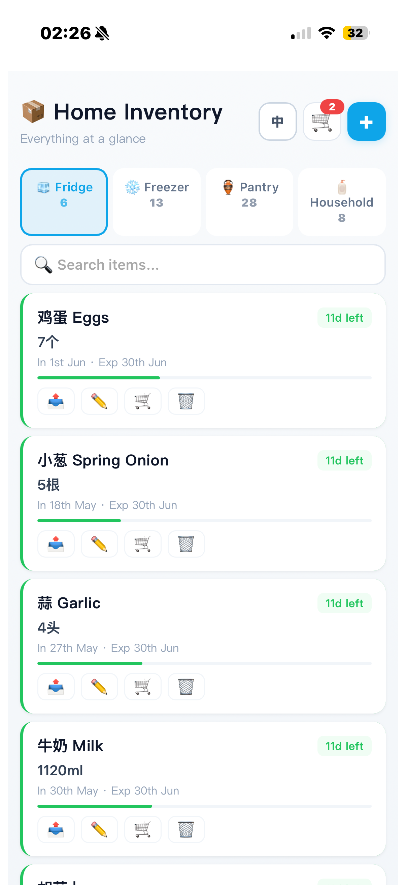
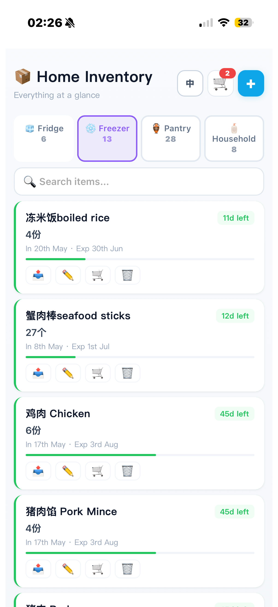

# 📦 Home Inventory

> **Everything at a glance.**
>
> A mobile-first home inventory management application designed to help households track food, supplies, storage locations, and expiration dates in one place.

---

# Overview

Home Inventory is a lightweight Progressive Web Application (PWA) that helps users manage household inventory efficiently.

Instead of forgetting what is stored in the fridge, freezer, pantry, or storage cabinet, users can maintain a complete overview of household items and monitor expiration dates through a clean and intuitive mobile interface.

The goal is simple:

> Know what you have.
>
> Know where it is.
>
> Know when it expires.

---

# Screenshots

## Main Dashboard



The dashboard provides a complete overview of inventory across different storage locations.

Users can quickly switch between:

* 🧊 Fridge
* ❄️ Freezer
* 🏺 Pantry
* 🧴 Household Supplies

Each category displays the number of stored items and allows instant filtering.

---

## Freezer Inventory



Each inventory card provides:

* Item name
* Quantity
* Storage date
* Expiration date
* Remaining shelf life
* Progress indicator
* Quick action buttons

This helps users monitor stored items without manually checking labels or maintaining spreadsheets.

---

# Features

## 🏠 Multi-Location Inventory Management

Track items stored in multiple locations:

* Fridge
* Freezer
* Pantry
* Household Storage

---

## 📅 Expiration Tracking

Monitor food freshness using:

* Expiration dates
* Remaining days indicators
* Shelf-life progress bars
* Visual status information

This helps reduce food waste and improve household organisation.

---

## 🔍 Search and Filtering

Quickly locate items using the built-in search functionality.

Users can:

* Search by item name
* Switch between storage locations
* Filter inventory instantly

---

## 🛒 Shopping Workflow

Items can be transferred into shopping workflows to simplify grocery planning and replenishment.

This helps users maintain awareness of low-stock items.

---

## 🌏 Bilingual Support

The application supports:

* English
* 中文 (Chinese)

making it suitable for multilingual households.

---

## 📱 Mobile-First Design

The interface is designed primarily for smartphones and tablets.

Key goals include:

* Fast interaction
* Clear visual hierarchy
* Simple inventory updates
* One-handed operation

---

## 📲 Progressive Web App (PWA)

Home Inventory is implemented as a Progressive Web App.

Benefits include:

* Install directly from a browser
* No App Store required
* Home screen icon support
* Mobile-friendly experience
* Automatic updates after deployment

---

# Technology Stack

Built with:

* React
* Vite
* JavaScript
* HTML5
* CSS3
* Progressive Web App (PWA)

Deployment:

* Vercel

---

# Installation

## Clone the Repository

```bash
git clone https://github.com/YOUR_USERNAME/Home-inventory.git
cd Home-inventory
```

---

## Install Dependencies

```bash
npm install
```

---

## Start Development Server

```bash
npm run dev
```

The application will be available at:

```text
http://localhost:5173
```

---

# Building for Production

Generate a production build:

```bash
npm run build
```

Compiled files will be generated inside:

```text
dist/
```

Preview production build locally:

```bash
npm run preview
```

---

# Deploying to Vercel

## Method 1 — GitHub Integration (Recommended)

1. Push the repository to GitHub.
2. Create a Vercel account.
3. Import the GitHub repository.
4. Vercel automatically detects the Vite project.
5. Click Deploy.

After deployment, Vercel generates a public URL.

Example:

```text
https://your-project.vercel.app
```

---

# Installing on Mobile Devices

Once deployed, Home Inventory can be installed as a mobile application.

## iPhone / iPad (Safari)

1. Open the deployed website in Safari.
2. Tap the Share button.
3. Select **Add to Home Screen**.
4. Confirm installation.

The application icon will appear on the home screen and launch like a native app.

---

## Android (Chrome)

1. Open the deployed website in Chrome.
2. Tap the browser menu.
3. Select **Install App** or **Add to Home Screen**.
4. Confirm installation.

The application will then function similarly to a native Android application.

---

# Use Cases

Home Inventory is particularly useful for:

* Families managing weekly groceries
* Students living independently
* Researchers with busy schedules
* Households with large freezer inventories
* Meal planning
* Food waste reduction
* Household consumable tracking

---

# Future Development

Potential future features include:

## 📷 Barcode Scanning

Automatically identify products using camera scanning.

---

## 🔔 Expiration Notifications

Receive reminders before products expire.

---

## ☁️ Cloud Synchronisation

Synchronise inventory across devices.

---

## 👨‍👩‍👧‍👦 Shared Family Accounts

Allow multiple household members to manage inventory collaboratively.

---

## 📊 Consumption Analytics

Visualise consumption patterns and household purchasing behaviour.

---

## 🤖 Smart Recommendations

Generate shopping suggestions based on inventory levels and consumption history.

---

# Project Motivation

Home Inventory was created to solve a simple but common problem:

> Many households lose track of what they already have.

Food expires unnoticed.

Items are purchased multiple times.

Freezers become difficult to manage.

By making inventory visible and easy to update, Home Inventory aims to reduce waste and simplify everyday household organisation.

---

# Author

**Shanshan Mao**

PhD Researcher in Multi-Agent Systems, Artificial Life, and Complex Adaptive Systems.

---

# License

Copyright © 2026 Shanshan Mao.

All rights reserved.

This repository is provided for educational and personal use. No part of this project may be reproduced, redistributed, modified, or used for commercial purposes without explicit permission from the author.
